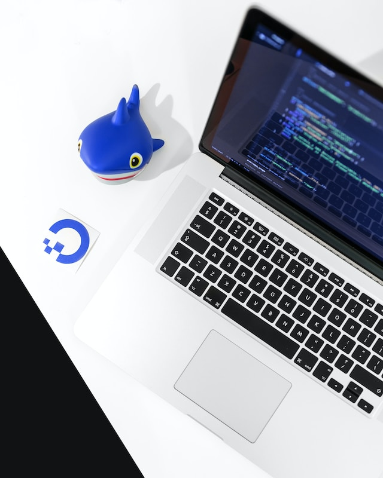

## Digitalocean'da flask uygulaması nasıl deploy edilir?(Docker ile deploy etme)





Merhaba! Bu rehberde, DigitalOcean üzerinde Flask uygulamanızı nasıl deploy edeceğinizi adım adım öğreneceksiniz. Flask, Python tabanlı hafif ve esnek bir web framework'tür. DigitalOcean ise bulut tabanlı sunucu hizmetleri sunan popüler bir platformdur. Bu iki güçlü aracı birleştirerek projelerinizi kolayca canlıya alabilirsiniz.
Flask'ın sunduğu basitlik ve esneklik, başlangıçtan ileri seviyeye kadar birçok projede tercih edilmesine neden olmaktadır. Özellikle mikro servisler, API'ler ve hızlı prototipleme için ideal bir seçimdir. DigitalOcean'ın kullanıcı dostu arayüzü ve maliyet etkin çözümleri, Flask uygulamalarınızı hızla ve güvenli bir şekilde deploy etme olanağı sunar. Bu kombinasyon, geliştiricilere hem kodlama hem de dağıtım süreçlerinde eşsiz bir kolaylık sağlar. Eğer siz de projenizi sorunsuz bir şekilde canlıya almak istiyorsanız, bu rehber tam size göre! Adım adım takip ederek, uygulamanızı kısa sürede DigitalOcean üzerinde çalışır duruma getirebilirsiniz.

### 1. Digitalocean'da bir droplet oluşturun

* [Digitalocean](https://www.digitalocean.com/) sitesine gidin ve bir hesap oluşturun.

* Sol üstteki "Create" butonuna tıklayın ve "Droplets" seçeneğini seçin.

* "Choose an image" kısmında "One-click apps" seçeneğini seçin.

* "Choose a size" kısmında "Basic" seçeneğini seçin.

### 2. SSH anahtarınızı oluşturun

* Bilgisayarınızda bir terminal açın.

* macOS ve Linux için: `cat ~/.ssh/id_rsa.pub | pbcopy` bu komutu çalıştırın. Windows için: `type %userprofile%\.ssh\id_rsa.pub | clip` bu komutu çalıştırın. Bu komutlar SSH anahtarınızı kopyalar.( [Kaynak](https://www.digitalocean.com/docs/droplets/how-to/add-ssh-keys/to-account/) )

* Digitalocean'da "Add SSH Key" butonuna tıklayın ve kopyaladığınız SSH anahtarını yapıştırın.

### 3. Droplet'ınızı oluşturun 

* "Choose a hostname" kısmına bir isim yazın.

* "Choose a datacenter region" kısmında "Frankfurt" yada  seçeneğini seçin.

* "Select additional options" kısmında "Monitoring" seçeneğini seçin.

* "Finalize and create" butonuna tıklayın.([Kaynak](https://www.digitalocean.com/docs/droplets/how-to/create/))

### 4. Droplet'ınızı kontrol edin ve SSH ile bağlanın

* Droplet'ınız oluşturulduktan sonra bir IP adresi alacaktır. Bu IP adresini kopyalayın.

* Bilgisayarınızda bir terminal açın.

* `ssh root@<IP adresi>` komutunu çalıştırın. IP adresini kopyaladığınız yere yapıştırın.

* "Are you sure you want to continue connecting (yes/no)?" sorusuna "yes" yazın ve enter'a basın.

### 5. Repoyu klonlayın ve bash dosyasını çalıştırın

* `git clone https://github.com/tgrlcyln/flask_digital_ocean_deploy_docker/flask_digital_ocean_deploy_docker.git` komutunu çalıştırın.

* `cd flask_digital_ocean_deploy_docker` komutunu çalıştırın.

*  bash dosyasını çalıştırın: 
    ```bash
    docker.sh 
    ```  
   Bu komut docker kurulumu yapar.

### 6. Uygulamayı çalıştırın ve kontrol edin

* docker ı build edin:
```bash
docker build . -t  flaskapp:1
 ```

* docker ı çalıştırın:

```bash
docker run -d -p 5000:5000 flaskapp:1
``` 

* Uygulamayı kontrol edin: 

```bash
http://<IP adresi>:5000
 ```

* eğer uygulama çalışıyorsa ekranda "Flask sunucuda çalışıyor" yazısını göreceksiniz.


Aklınıza takılan soruları için [github](https://github.com/tgrlcyln) üzerinden bana ulaşabilirsiniz.